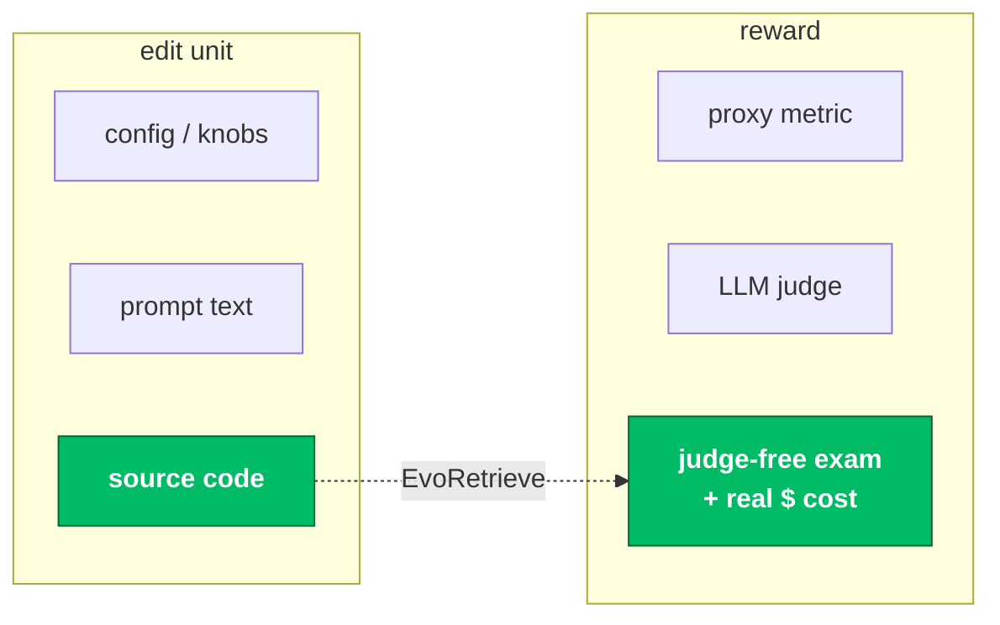
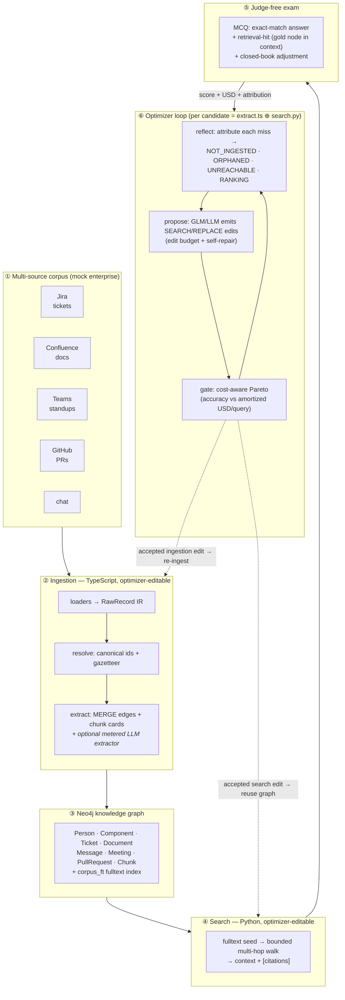
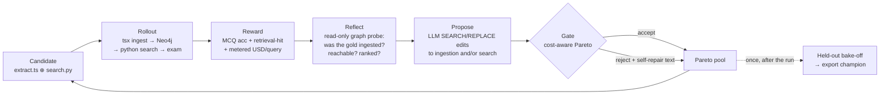

# EvoRetrieve

### A self-improving optimizer that rewrites the source code of a GraphRAG system — co-evolving **ingestion** and **search**, gated by a judge-free exam and priced in **real USD per query**.

**code-evolution** · **judge-free reward** · **accuracy–cost Pareto** · **ingestion ⊕ search co-design**

[-6f42c1)](https://stark.stanford.edu/)

 

**The evolved retrieval service clears every published baseline on the
[🤗 STaRK-Prime leaderboard](https://huggingface.co/spaces/snap-stanford/stark-leaderboard) —
including AvaTaR, itself an LLM-agent optimizer built for this benchmark.**

<picture>
  <source media="(prefers-color-scheme: dark)" srcset="docs/assets/stark-prime-leaderboard-dark.svg">
  
</picture>

STaRK-Prime synthesized `test` split. Baselines: official
[🤗 leaderboard](https://huggingface.co/spaces/snap-stanford/stark-leaderboard) /
[STARK paper](https://arxiv.org/abs/2404.13207) / [AvaTaR](https://arxiv.org/abs/2406.11200),
full 2,801-query split. Ours: 900-query locked subset of the same split, evaluated once with the
official STARK evaluator (MLflow `final-test-report`, campaign `run14_glm`). Full table and
provenance in [§4](#4--results).

---

## Abstract

Self-improving "code-evolution" optimizers — FunSearch, AlphaEvolve, kernel-evolution
systems — turn an LLM into a *mutation operator* over source code: **propose an edit →
evaluate against an oracle → keep it if it wins → repeat.** They have produced striking
results, but almost exclusively where the oracle is cheap and exact and the objective is a
single number (a math score, a kernel speedup).

**EvoRetrieve asks how far that idea goes when the target is a real, multi-component GraphRAG
system** — where quality is semantic, the graph must be *built* before it can be searched,
and every query costs money. The optimizer edits the **actual TypeScript ingestion** that
builds a Neo4j knowledge graph **and** the **Python search** that traverses it, scores each
candidate with a **deterministic multiple-choice exam** (no LLM judge to game), meters every
candidate in **real USD/query**, and selects on the **accuracy–cost Pareto frontier**.

> **Headline.** On the public **STARK-Prime** benchmark the evolved multi-file retrieval
> service scores **Recall@20 52.9 / Hit@1 28.2** on a 900-query locked test split — above
> every published leaderboard baseline (best: AvaTaR-GPT-4-turbo at 42.2 / 20.1) — and the
> optimizer's gain is cleanly attributable: its own seed scored 47.6 / 24.0 on the identical
> split. On a hand-built 5-source enterprise corpus (Jira · Confluence · Teams · GitHub ·
> chat → 219-node graph, 81-question exam), co-optimizing ingestion + search lifted a
> hand-written seed from **0.767 → 0.967 MCQ accuracy** (retrieval-hit 0.73 → 1.00),
> holdout-confirmed at **0.964** — at **$0.0002/query**, because the cost-aware gate refused
> every more expensive fix.

---

## 1 · The gap

RAG quality is dominated by retrieval, and the most consequential retrieval decisions in a
**graph** RAG system are *procedural* — how to seed entities, how far and how selectively to
traverse, when to spend an LLM call, when to stop — **and how the graph was built in the
first place.** Those decisions live in **code**, not in a hyperparameter.

Today's automated RAG optimization mostly searches over **configurations**: it recombines
modules an engineer already wrote ([AutoRAG](https://arxiv.org/abs/2410.20878)). Code-evolution
optimizers *can* synthesize genuinely new procedures — but they've been pointed at math and
kernels, never at a RAG node against a live graph, never with money on the objective, and
**never at the coupling between *ingestion* and *search*** — the case where changing how the
graph is built reshapes what search must do, so the two have to be optimized *together*.

**The claim is deliberately narrow and defensible:** reflective code-evolution applied to a
GraphRAG system, gated by a judge-free exam, with measured USD/query as a Pareto axis — and a
characterization of how the optimizer behaves as the target grows from **one function** to a
**coupled ingestion + search system.** Unlike prompt-only optimizers (AvaTaR, GEPA) and
config search (AutoRAG), the edit unit is the system's real source — including the ingestion
that builds the graph — which removes the fixed-program *and* the fixed-index assumption.

---

## 2 · System architecture

A *candidate* is an overlay of two real source files — the **ingestion** (`extract.ts`, builds
the graph) and the **search** (`search.py`, traverses it). Scoring is a **two-phase rollout**:
rebuild the graph, then search it over the exam. Ingestion is cached by the hash of the `.ts`
files, so a search-only edit reuses the graph and only an ingestion edit triggers a rebuild.

**Where each part runs.** Ingestion is a one-shot `tsx ingest.ts` subprocess that `--wipe`s and
rebuilds an **isolated Neo4j database** from the candidate's `extract.ts`. Search is the
candidate's `search.py`, imported fresh per candidate (throwaway module) and run in-process
against that graph — the same answerer/USD path as production scoring. The winner is exported
and can be lifted straight back into the live retrieval service.

---

## 3 · How one optimization step works

- **Candidate = code.** Real source, run against a live graph DB in subprocess isolation — not a sandboxed toy.
- **Reward = judge-free exam.** Deterministic exact-match MCQ accuracy; a closed-book adjustment credits what *retrieval* adds over the model's parametric knowledge.
- **Feedback = graph-aware attribution.** Every miss is probed read-only and bucketed
  `NOT_INGESTED` (gold node absent) / `ORPHANED` (present, no path from seeds) / `UNREACHABLE`
  (path exists, search didn't reach it) / `RANKING` — so the optimizer is told *which side to fix.*
- **Selection = cost-aware Pareto.** Acceptance blends accuracy against amortized USD/query
  (`ingest_usd / N + search_usd`); a Pareto pool keeps a frontier, not one winner; a
  complexity/crash filter stops degenerate "wins."
- **Honesty = leakage control.** Per-run scores use small rotating gate sets; the trustworthy
  number is the once-only held-out bake-off.

---

## 4 · Results

### STARK-Prime — versus the public leaderboard

Public benchmark: [STARK](https://stark.stanford.edu/)-Prime (Stanford, NeurIPS 2024) —
semi-structured retrieval over a 129k-node biomedical KG, scored by node-containment
Hit@1 / Hit@5 / Recall@20 / MRR. The optimizer rewrites the multi-file retrieval service
(fulltext seeding, typed anchor-hops, Cypher, fusion math, rerank prompts) against a live
graph database. All numbers are percentages.

| STARK-Prime `test` | Hit@1 | Hit@5 | Recall@20 | MRR |
|---|---|---|---|---|
| ColBERTv2 | 11.75 | 23.85 | 25.04 | 17.39 |
| BM25 | 12.75 | 27.92 | 31.25 | 19.84 |
| VSS (text-embedding-ada-002) | 12.63 | 31.49 | 36.00 | 21.41 |
| Multi-VSS (multi-ada-002) | 15.10 | 33.56 | 38.05 | 23.49 |
| GritLM-7b | 15.57 | 33.42 | 39.09 | 24.11 |
| AvaTaR (Claude-3-Opus) | 18.44 | 36.73 | 39.31 | 26.73 |
| AvaTaR (GPT-4-turbo) | 20.10 | 39.89 | 42.23 | 29.18 |
| Our hand-written seed service | 24.0 | 41.8 | 47.6 | 32.7 |
| **Ours — evolved champion (run14)** | **28.2** | **49.8** | **52.9** | **38.2** |

Two things are true at once, and we report both. **The system beats the leaderboard** — the
evolved champion clears AvaTaR-GPT-4-turbo by **+10.7 pts Recall@20 / +8.1 pts Hit@1**, with a
GLM-5.2 mutator (~$5–6 for the whole run) and Gemini-2.5-Flash-Lite at retrieval time, no
GPT-4 anywhere in the loop. **And the optimizer's contribution is isolated**: the seed and
champion were scored on the *identical* 900-query locked split, so the evolution itself is
worth **+5.3 pts Recall@20 / +4.2 pts Hit@1 / +8.0 pts Hit@5** on top of an already-strong
hand-written seed. On the separate 300-query held-out bake-off the progression across
campaigns is monotone: single-function champion **0.435** → whole-service seed **0.455** →
run14 champion **0.492** → run15 archipelago champion **0.536** recall@20.

Baselines: [STARK paper](https://arxiv.org/abs/2404.13207) · [AvaTaR](https://arxiv.org/abs/2406.11200) ·
[🤗 leaderboard](https://huggingface.co/spaces/snap-stanford/stark-leaderboard), full 2,801-query
synthesized `test` split. Ours: 900-query locked subset, evaluated once (MLflow
`final-test-report`; artifacts in `graphretr-demo/runs/`). Specialized 2025 methods (LLM
query-expansion, fine-tuned GraphRAFT) report higher and are out of scope for this baseline
comparison. Phase-1 origin, for the record: evolving *one* `search()` function took a simple
seed from ~0.25 to **0.435 recall@20 / 0.28 hit@1** held-out — the whole-service numbers above
are the same idea scaled up.

### The optimizer at work — evolution and co-optimization

<picture>
  <source media="(prefers-color-scheme: dark)" srcset="docs/assets/cooptimize-evolution-dark.svg">
  
</picture>

**A** — every *accepted* candidate's recall@20 on the rotating gate sets (small and
deliberately noisy — the trustworthy numbers are the held-out ones above), from
`runs/*/lineage.jsonl`. run14: 23 accepted edits over 40 steps, seed 0.46 → gate peak 0.638.
Its champion then **seeds the run15 archipelago island** (cross-run chaining), which starts at
0.56 and pushes the held-out champion to 0.536. **B** — the ingestion ⊕ search co-optimization
target: the 5-source enterprise corpus, where the same loop edits `extract.ts` (graph
construction) and `search.py` (traversal) together; seed → co-optimized, holdout-confirmed
0.964.

### Co-optimizing ingestion + search on the multi-source graph

A hand-built mock enterprise corpus spanning **five sources** — Jira, Confluence, Teams
standups, GitHub PRs, and chat — ingested into a **219-node / 485-edge** Neo4j graph with
genuine cross-system chains (*a problem in a Jira ticket → its solution decided in a Teams
standup → implemented in a GitHub PR → documented in Confluence*). The exam is **81 judge-free
MCQs** (30 structured · 12 multi-hop · 7 cross-source · 20 free-text · 12 multi-gold/aggregation).

| Program | MCQ accuracy | retrieval-hit | ingest USD | total USD/query |
|---|---|---|---|---|
| Hand-written seed (zero-LLM ingestion) | 0.767 | 0.733 | $0.000 | ~$0.0002 |
| **Co-optimized (best, exported)** | **0.967** | **1.000** | **$0.000** | ~$0.0002 |
| | **+0.20** | **+0.27** | — | held-out **0.964** |

The optimizer reached 0.967 by **co-evolving the search procedure** (widening the fulltext
seed, adding exact-id seeding, deepening the bounded walk) — selected over paying for LLM
extraction because the cost-aware gate preferred the **$0** fix (see §5). On the STARK target
the editable set is the search service; on this target the editable set is
`{extract.ts, search.py}` — the two-track co-optimization harness
(`ingest_editable_files`, per-candidate graph rebuild, amortized ingest cost in the gate) is
what this branch adds.

---

## 5 · Analysis — *why* it behaves this way

- **Attribution localizes the fix.** On the multi-source corpus the seed's misses probed as
  `UNREACHABLE` (the answer nodes — PRs, docs — sat just beyond the selective retriever). The
  optimizer followed that signal and edited **search**, not ingestion — the right lever.
- **Coupling is real and observable.** On a smaller corpus where *search was frozen*, the same
  misses forced an **ingestion** fix instead: the optimizer added graph-transitivity edges so
  the answer became reachable within the bounded walk (0.93 → 0.97). Flip which file is editable
  and the optimizer co-adapts the other side — the central claim, shown both ways.
- **The cost-aware gate refuses to overspend.** We deliberately planted questions whose answer
  link lives *only* in prose (no rule-based edge — Cypher-proven). The optimizer **still never
  turned on the LLM extractor**: widening fulltext search retrieved the answer chunk directly,
  for **$0**, so paying tokens for extraction was correctly rejected. *A negative result that is
  itself a finding:* with fulltext seeding + an LLM answerer, making expensive ingestion the
  **only** way to win is a genuine reward-design problem — exactly the kind of honesty the gate
  is there to enforce.
- **Where the STARK lift comes from.** The accepted edits *expand reach* — typed anchor-hop
  traversal, per-keyword conjunction bridges, query reformulation, a 2-hop BFS fallback — not
  just reranking a dense pool. That is the kind of *procedural* change a config search cannot
  express.

---

## 6 · What this proof-of-concept maps out — the design space

The deeper point of the project is not one leaderboard number. Systems like AlphaEvolve,
KernelEvolve, GEPA and SkillOpt are all points in a **shared design space for self-improving
optimizers**, and most of that space is unexplored for targets like RAG. EvoRetrieve was built
as an *instrument* to explore those axes on a real system — each lever below is a concrete
knob in this codebase, with what we observed when we turned it.

The optimizer is an SGD-shaped loop over code, so the knobs have direct deep-learning analogues:

| DL knob | This optimizer | Concretely here |
|---|---|---|
| minibatch | rollout batch of exam queries | rotating gate sets per step |
| learning rate | edit budget per proposal | SEARCH/REPLACE hunk cap + self-repair retries |
| validation set | the selection gate | cost-aware Pareto gate on the gate set |
| test set | held-out bake-off | once-only 300-query / 900-query splits |
| momentum / warm start | seed choice + cross-run chaining | run15 islands seeded from run14's champion |

| Design lever | Our choice | The alternative(s) | What we observed |
|---|---|---|---|
| **Reward function** | judge-free MCQ exam, exact match, + closed-book adjustment | LLM judge; proxy metrics | Ungameable and deterministic — but **exam design becomes the binding constraint**: whether the optimizer has attributable headroom is decided by the corpus + questions, not the engine. |
| **Second objective** | measured **USD/query** on a Pareto frontier | accuracy-only | The gate provably refuses expensive fixes when a $0 fix exists (§5) — and never "wins" by overspending. |
| **Environment** | live Neo4j, but **per-candidate isolation**: subprocess rollout, single-DB wipe + lock, ingest cache by content hash | shared mutable state; pure simulation | Isolation bugs masquerade as model failures — a cold-cache timeout + cache-write race once scored a healthy run 0.0. Sandbox hygiene is not optional plumbing; it is the experiment's validity. |
| **Degrees of freedom** | free multi-file code edits, bounded by an edit budget + complexity/crash filter | constrained templates; config knobs | With a weak complexity gate the optimizer "wins" by bloat until it crash-spirals; the filter is what makes free-form editing survivable. |
| **Step size / noise** | small rotating gate sets, edit budget per step | one big fixed eval per step | Cheap noisy steps explore more per dollar, but make in-run scores untrustworthy — hence the strict once-only bake-off discipline. |
| **Seed program** | hand-written seed; later runs seeded from prior champions | always from scratch | Seed choice dominates early trajectory (a re-ported champion starts at 0.56 vs 0.46); **cross-run seed-chaining** is the cheapest transfer mechanism we found. |
| **What the optimizer is told** | reflection = graph-aware failure attribution (`NOT_INGESTED / ORPHANED / UNREACHABLE / RANKING`) + rejected-edit self-repair text | raw scores only ("evolution"), or free-form critique | Attribution is a *textual gradient* with direction: it tells the optimizer **which subsystem** (ingestion vs search) to edit, which is exactly what a coupled target needs. |
| **Memory between runs** | artifacts-as-memory: lineage, Pareto pool, MLflow, seed-chaining | a distilled "how to write retrievers" skill doc (SkillOpt-style) | Retrieval-style memory carried run14 → run15 cleanly; distillation into a transferable strategy document is the obvious open next step. |
| **Orchestration** | single loop → **DAG archipelago**: islands, cross-run seed chaining, tournament merge | one greedy incumbent | The archipelago's champion (0.536 held-out) beats the single loop's (0.492) on the identical split — population structure pays even at this small scale. |
| **Mutation backend** | GLM-5.2 via z.ai (~$5–6/run); Claude CLI pluggable | frontier-only mutators | A budget mutator suffices — but ~30–40% of its edits arrive unparseable, so edit-format robustness (self-repair) is a first-class budget line, not a detail. |

---

## 7 · Limitations & reproducibility

- **Corpus design is the binding constraint.** Whether the optimizer has *attributable headroom*
  — and whether an expensive lever is ever *necessary* — is decided by the exam, not the engine.
  Making LLM extraction strictly required (vs. substitutable by search) is open work.
- **The scaled STARK runs evolved the search side.** The full two-track co-optimization
  (ingestion + search in one run) is validated end-to-end on the enterprise-corpus target;
  scaling it to STARK-sized campaigns is the next run, not a done result.
- **Mutator reliability.** The GLM (z.ai) mutation backend intermittently emits unparseable
  edits (~30–40% of steps), which burns budget; this is a fixable parsing/format issue, not a
  loop defect.
- **Reproducibility.** Two-phase rollout against a live Neo4j DB; MLflow tracking; per-run
  rotating gate sets + a once-only held-out bake-off; complexity/crash filters. Runs land under
  `graphretr-demo/runs/<name>/` with full lineage (`lineage.jsonl`), per-step overlays, the
  reflection transcripts, and the exported champion. Every number in §4 traces to a named
  artifact (`select_holdout.json`, `lineage.jsonl`, MLflow `final-test-report`).

---

## 8 · Repository layout

| Path | What it is |
|---|---|
| [`graphretr-demo/`](graphretr-demo) | The optimizer core — loop, Pareto pool, cost-aware gate, two-phase reward adapter, attribution probe, MLflow. |
| [`graphmod/`](graphmod) | Typed, validated **Neo4j ingestion framework** (TypeScript). The optimizer-editable `extract.ts` + schema modules for all 7 node types. |
| [`graphsearch/`](graphsearch) | The graph-QA target: editable `search.py`, the mock 5-source corpus, and the judge-free MCQ exam. |
| [`starksearch/`](starksearch) | Phase-1/2 STARK target (public benchmark). |
| [`Orchestration/`](Orchestration) | Design docs — the co-optimize contract, runbooks, and the DAG-archipelago meta-orchestrator. |

**Stack.** Python 3.11 (optimizer + search), TypeScript/Node (`graphmod` ingestion), Neo4j 5
(Enterprise, multi-db isolation). Answerer + in-search LLM via OpenRouter; the code-mutation
backend is GLM via z.ai (or the Claude CLI). Experiment tracking via MLflow.

---

## 9 · Related work — and where this sits

Positioning by axes, not by list — the rightmost columns are the ones no prior system occupies
together:

| System | Edit unit | Feedback signal | Reward | $-aware | Touches ingestion |
|---|---|---|---|---|---|
| [FunSearch](https://www.nature.com/articles/s41586-023-06924-6) / [AlphaEvolve](https://arxiv.org/abs/2506.13131) / [KernelEvolve](https://arxiv.org/abs/2512.23236) | code | exact oracle score | math / speedup | — | — |
| [GEPA](https://arxiv.org/abs/2507.19457) / [DSPy-MIPROv2](https://arxiv.org/abs/2406.11695) / TextGrad / OPRO | prompts | reflective text / scores | task metric | — | — |
| [AvaTaR](https://arxiv.org/abs/2406.11200) | agent prompts | contrastive reasoning | benchmark metric | — | — |
| [AutoRAG](https://arxiv.org/abs/2410.20878) | pipeline config | grid / greedy search | task metric | — | — |
| [Voyager](https://arxiv.org/abs/2305.16291) / [ADAS](https://arxiv.org/abs/2408.08435) | skills / agent designs | env. reward / meta-search | env. success | — | — |
| **EvoRetrieve** | **multi-file source (ingestion + search)** | **graph-aware failure attribution** | **judge-free exam** | **USD/query Pareto** | **yes — graph construction itself** |

Judge-free RAG examination builds on [Guinet et al. (ICML 2024)](https://arxiv.org/abs/2405.13622).
The open research framing — matching the *search topology* to the design space's factor
structure (structured niching, branch-and-converge, staged credit assignment) — is mapped in
[`Orchestration/`](Orchestration) and the companion optimizer wiki.
