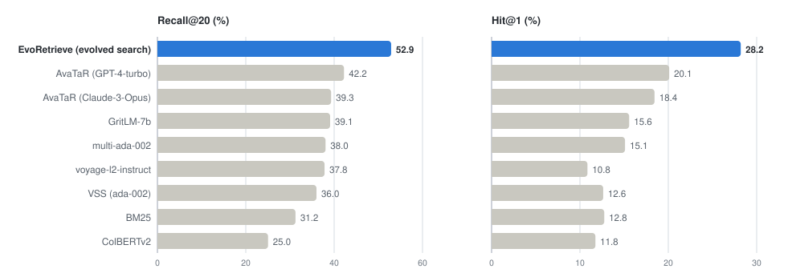
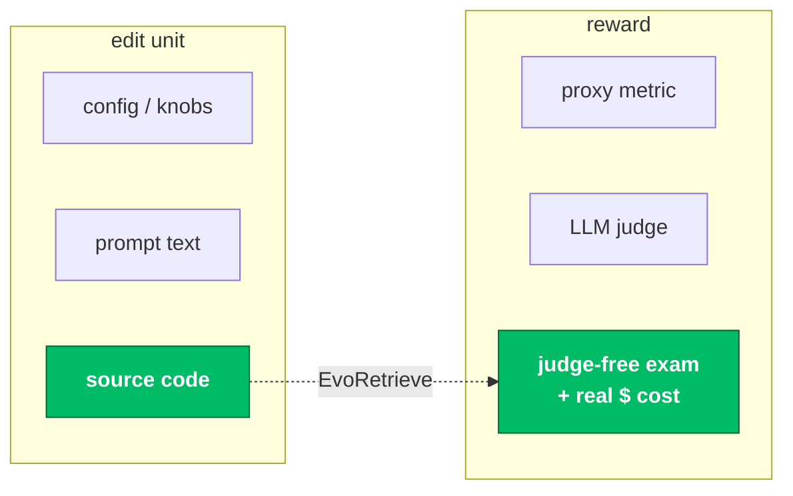
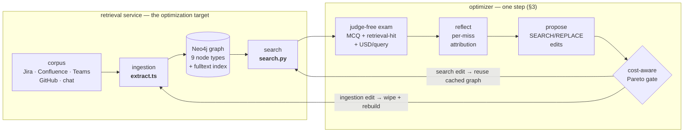
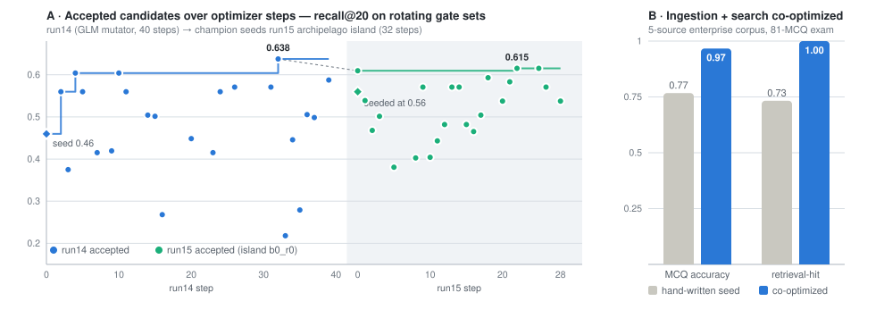

# EvoRetrieve

### A self-improving optimizer that rewrites the source code of a GraphRAG system — co-evolving **ingestion** and **search**, gated by a judge-free exam and priced in **real USD per query**.

**code-evolution** · **judge-free reward** · **accuracy–cost Pareto** · **ingestion ⊕ search co-design**

[-6f42c1)](https://stark.stanford.edu/)

 

**The evolved retrieval service clears every published baseline on the
[🤗 STaRK-Prime leaderboard](https://huggingface.co/spaces/snap-stanford/stark-leaderboard) —
including AvaTaR, itself an LLM-agent optimizer built for this benchmark.**

<picture>
  <source media="(prefers-color-scheme: dark)" srcset="docs/assets/stark-prime-leaderboard-dark.svg">
  
</picture>

STaRK-Prime synthesized `test` split. Baselines: official
[🤗 leaderboard](https://huggingface.co/spaces/snap-stanford/stark-leaderboard) /
[STARK paper](https://arxiv.org/abs/2404.13207) / [AvaTaR](https://arxiv.org/abs/2406.11200),
full 2,801-query split. Ours: 900-query locked subset of the same split, evaluated once with the
official STARK evaluator (MLflow `final-test-report`, campaign `run14_glm`). Full table and
provenance in [§4](#4--results).

---

## Abstract

Self-improving "code-evolution" optimizers — FunSearch, AlphaEvolve, kernel-evolution
systems — turn an LLM into a *mutation operator* over source code: **propose an edit →
evaluate against an oracle → keep it if it wins → repeat.** They have produced striking
results, but almost exclusively where the oracle is cheap and exact and the objective is a
single number (a math score, a kernel speedup).

**EvoRetrieve asks how far that idea goes when the target is a real, multi-component GraphRAG
system** — where quality is semantic, the graph must be *built* before it can be searched,
and every query costs money. The optimizer edits the **actual TypeScript ingestion** that
builds a Neo4j knowledge graph **and** the **Python search** that traverses it, scores each
candidate with a **deterministic multiple-choice exam** (no LLM judge to game), meters every
candidate in **real USD/query**, and selects on the **accuracy–cost Pareto frontier**.

> **Headline.** On the public **STARK-Prime** benchmark the evolved multi-file retrieval
> service scores **Recall@20 52.9 / Hit@1 28.2** on a 900-query locked test split — above
> every published leaderboard baseline (best: AvaTaR-GPT-4-turbo at 42.2 / 20.1) — and the
> optimizer's gain is cleanly attributable: its own seed scored 47.6 / 24.0 on the identical
> split. On a hand-built 5-source enterprise corpus (Jira · Confluence · Teams · GitHub ·
> chat → 219-node graph, 81-question exam), co-optimizing ingestion + search lifted a
> hand-written seed from **0.767 → 0.967 MCQ accuracy** (retrieval-hit 0.73 → 1.00),
> holdout-confirmed at **0.964** — at **$0.0002/query**, because the cost-aware gate refused
> every more expensive fix.

---

## 1 · The gap

RAG quality is dominated by retrieval, and the most consequential retrieval decisions in a
**graph** RAG system are *procedural* — how to seed entities, how far and how selectively to
traverse, when to spend an LLM call, when to stop — **and how the graph was built in the
first place.** Those decisions live in **code**, not in a hyperparameter.

Today's automated RAG optimization mostly searches over **configurations**: it recombines
modules an engineer already wrote ([AutoRAG](https://arxiv.org/abs/2410.20878)). Code-evolution
optimizers *can* synthesize genuinely new procedures — but they've been pointed at math and
kernels, never at a RAG node against a live graph, never with money on the objective, and
**never at the coupling between *ingestion* and *search*** — the case where changing how the
graph is built reshapes what search must do, so the two have to be optimized *together*.

**The claim is deliberately narrow and defensible:** reflective code-evolution applied to a
GraphRAG system, gated by a judge-free exam, with measured USD/query as a Pareto axis — and a
characterization of how the optimizer behaves as the target grows from **one function** to a
**coupled ingestion + search system.** Unlike prompt-only optimizers (AvaTaR, GEPA) and
config search (AutoRAG), the edit unit is the system's real source — including the ingestion
that builds the graph — which removes the fixed-program *and* the fixed-index assumption.

---

## 2 · System architecture

A **candidate** is an overlay of two real source files: `extract.ts` (builds the graph) and
`search.py` (traverses it). Scoring is a **two-phase rollout** — rebuild the graph, then
answer the exam through it. Everything else is the loop that edits those two files.

The two editable files have deliberately asymmetric execution contracts:

| | Ingestion | Search |
|---|---|---|
| **File** | `graphmod/src/ingestion/extract.ts` (TypeScript) | `graphsearch/src/search/search.py` (Python) |
| **Runs as** | one-shot `npx tsx ingest.ts` subprocess | fresh throwaway import, in-process |
| **Isolation** | shared single DB, wiped under an **exclusive lock** before each build | **shared lock** held while scoring, so no concurrent rebuild |
| **Caching** | graph keyed by content-hash of the `.ts` overlay (+ `--llm` flag) | none needed |
| **Cost accounting** | ingest USD amortized over the query budget (`ingest_usd / N`) | metered per query |
| **An edit triggers** | full re-ingest | cache hit — ingestion skipped entirely |

The exported champion is the same code path as production scoring, so it lifts straight back
into the live retrieval service.

---

## 3 · One optimization step

| Stage | What happens |
|---|---|
| **Rollout** | Rebuild the graph from the candidate's `extract.ts` (cache-hit if only search changed), then run its `search.py` over the exam against the live DB. |
| **Reward** | Deterministic exact-match MCQ accuracy + retrieval-hit (gold node in context) + a closed-book adjustment that credits what *retrieval* adds over parametric knowledge. Every LLM call metered in USD. |
| **Reflect** | Each miss is probed read-only in the graph and bucketed (below) — the optimizer is told *which subsystem* to fix, not just a score. |
| **Propose** | The mutator LLM (GLM-5.2 / Claude CLI) emits SEARCH/REPLACE edits to either file, under an edit budget with self-repair retries on rejects. |
| **Gate** | Accept onto a **Pareto pool** over (accuracy, amortized USD/query); a complexity/crash filter kills degenerate "wins". |
| **Bake-off** | Once per run, the frontier is scored on an untouched held-out split; the champion is exported. In-run gate scores are small and rotating — only the bake-off number is trusted. |

The attribution buckets are the system's *textual gradient* — each has a direction:

| Bucket | The gold answer node is… | Points at |
|---|---|---|
| `NOT_INGESTED` | absent from the graph | **ingestion** |
| `ORPHANED` | present, but no path from any seed | **ingestion** |
| `UNREACHABLE` | connected, but the bounded walk never reached it | **search** |
| `RANKING` | reached, but ranked below the cutoff | **search** |

---

## 4 · Results

### STARK-Prime — versus the public leaderboard

[STARK](https://stark.stanford.edu/)-Prime (Stanford, NeurIPS 2024): semi-structured retrieval
over a 129k-node biomedical KG, scored by node containment. Here the optimizer rewrites the
multi-file retrieval service — fulltext seeding, typed anchor-hops, Cypher, fusion math,
rerank prompts — against the live graph. All numbers are percentages.

| STARK-Prime `test` | Hit@1 | Hit@5 | Recall@20 | MRR |
|---|---|---|---|---|
| ColBERTv2 | 11.75 | 23.85 | 25.04 | 17.39 |
| BM25 | 12.75 | 27.92 | 31.25 | 19.84 |
| VSS (text-embedding-ada-002) | 12.63 | 31.49 | 36.00 | 21.41 |
| Multi-VSS (multi-ada-002) | 15.10 | 33.56 | 38.05 | 23.49 |
| GritLM-7b | 15.57 | 33.42 | 39.09 | 24.11 |
| AvaTaR (Claude-3-Opus) | 18.44 | 36.73 | 39.31 | 26.73 |
| AvaTaR (GPT-4-turbo) | 20.10 | 39.89 | 42.23 | 29.18 |
| Our hand-written seed service | 24.0 | 41.8 | 47.6 | 32.7 |
| **Ours — evolved champion (run14)** | **28.2** | **49.8** | **52.9** | **38.2** |

Two results, one table. **The system beats the leaderboard**: +10.7 Recall@20 / +8.1 Hit@1
over AvaTaR-GPT-4-turbo, with a GLM-5.2 mutator (~$5–6 for the whole run) and
Gemini-2.5-Flash-Lite at retrieval time — no GPT-4 anywhere in the loop. **And the optimizer's
contribution is isolated**: seed and champion were scored on the identical 900-query locked
split, so the evolution alone is worth **+5.3 Recall@20 / +4.2 Hit@1 / +8.0 Hit@5**. On the
separate 300-query held-out bake-off the cross-campaign progression is monotone:
**0.435** (single evolved function) → **0.455** (whole-service seed) → **0.492** (run14) →
**0.536** (run15 archipelago) recall@20.

Baselines: [STARK paper](https://arxiv.org/abs/2404.13207) · [AvaTaR](https://arxiv.org/abs/2406.11200) ·
[🤗 leaderboard](https://huggingface.co/spaces/snap-stanford/stark-leaderboard), full 2,801-query
synthesized `test` split. Ours: 900-query locked subset of the same split, evaluated once
(MLflow `final-test-report`, artifacts in `graphretr-demo/runs/`). Specialized 2025 methods
(LLM query-expansion, fine-tuned GraphRAFT) report higher and are out of scope for this
baseline comparison.

### The optimizer at work

<picture>
  <source media="(prefers-color-scheme: dark)" srcset="docs/assets/cooptimize-evolution-dark.svg">
  
</picture>

**A** — every *accepted* candidate's recall@20 on the rotating gate sets, from
`runs/*/lineage.jsonl`: run14 takes the seed 0.46 → gate peak 0.638 in 23 accepted edits, and
its champion then seeds a run15 archipelago island (cross-run chaining) that starts at 0.56
and lands the 0.536 held-out champion. **B** — the co-optimization target: seed vs
co-optimized on the enterprise corpus, holdout-confirmed 0.964.

### Co-optimizing ingestion + search on the multi-source graph

The co-design target: a hand-built mock enterprise corpus over five sources, ingested into a
219-node / 485-edge Neo4j graph with genuine cross-system chains (*problem in a Jira ticket →
solution decided in a Teams standup → implemented in a GitHub PR → documented in Confluence*).
The exam is 81 judge-free MCQs (structured · multi-hop · cross-source · free-text · multi-gold).
Here the editable set is `{extract.ts, search.py}` — both sides of the coupling at once.

| Program | MCQ accuracy | retrieval-hit | ingest USD | total USD/query |
|---|---|---|---|---|
| Hand-written seed (zero-LLM ingestion) | 0.767 | 0.733 | $0.000 | ~$0.0002 |
| **Co-optimized (best, exported)** | **0.967** | **1.000** | **$0.000** | ~$0.0002 |
| | **+0.20** | **+0.27** | — | held-out **0.964** |

The optimizer got there by co-evolving the **search** procedure — wider fulltext seed,
exact-id seeding, a deeper bounded walk — and never paid for LLM extraction, because the
cost-aware gate preferred the $0 fix (§5).

---

## 5 · Analysis — *why* it behaves this way

- **Attribution localizes the fix.** The enterprise seed's misses probed `UNREACHABLE` — the
  answer nodes sat just beyond the selective retriever — so the optimizer edited **search**,
  not ingestion. The right lever, chosen from the signal.
- **The coupling is real, shown both ways.** On a corpus where *search was frozen*, the same
  misses forced an **ingestion** fix instead: the optimizer added transitivity edges until the
  answers became reachable (0.93 → 0.97). Flip which file is editable and it co-adapts the other side.
- **The gate refuses to overspend.** We planted questions whose answer link exists *only* in
  prose (no rule-based edge — Cypher-proven). The optimizer still never enabled the LLM
  extractor: widening fulltext retrieved the answer chunk for $0, so paid extraction was
  correctly rejected. The negative result is itself a finding — making an expensive lever
  *necessary* (not just available) is a reward-design problem.
- **Where the STARK lift comes from.** The accepted edits *expand reach* — typed anchor-hops,
  per-keyword conjunction bridges, query reformulation, a 2-hop BFS fallback — procedural
  changes a config search cannot express.

---

## 6 · The design space this instrument explores

The deeper point is not one leaderboard number: AlphaEvolve, KernelEvolve, GEPA and SkillOpt
are all points in a shared design space for self-improving optimizers, and most of it is
unexplored for RAG-like targets. The loop is SGD-shaped — rotating gate sets are the
minibatch, the edit budget the learning rate, the Pareto gate the validation set, the
once-only bake-off the test set, seed-chaining the warm start — and every lever below is a
concrete knob in this codebase, with what we observed when we turned it.

| Lever | Choice here | What we observed |
|---|---|---|
| **Reward** | judge-free MCQ exam + closed-book adjustment | Ungameable and deterministic — but exam design becomes the binding constraint (§7). |
| **Second objective** | measured USD/query on a Pareto frontier | The gate provably refuses paid fixes when a $0 fix exists (§5). |
| **Environment** | live Neo4j; per-candidate wipe + lock, content-hash ingest cache | Isolation bugs masquerade as model failures — one cache race scored a healthy run 0.0. Sandbox hygiene *is* the experiment's validity. |
| **Degrees of freedom** | free multi-file edits + edit budget + complexity/crash filter | Without the filter the optimizer "wins" by bloat, then crash-spirals. |
| **Step size** | small rotating gate sets per step | More exploration per dollar, untrustworthy in-run scores — hence the once-only bake-off discipline. |
| **Seed** | hand-written; later runs seeded from prior champions | Seed dominates the early trajectory (0.56 vs 0.46 start); cross-run chaining is the cheapest transfer we found. |
| **Feedback** | graph-aware miss attribution + rejected-edit self-repair text | A *textual gradient with direction*: it names the subsystem to edit — exactly what a coupled target needs. |
| **Memory** | artifacts-as-memory: lineage, Pareto pool, MLflow, seed-chaining | Carried run14 → run15 cleanly; distilling a transferable strategy doc (SkillOpt-style) is the open next step. |
| **Orchestration** | single loop → DAG archipelago (islands, tournament merge) | The archipelago champion beats the single loop's, 0.536 vs 0.492, on the identical split — population structure pays even at this scale. |
| **Mutator** | GLM-5.2 via z.ai (~$5–6/run); Claude CLI pluggable | A budget mutator suffices — but ~30–40% of edits arrive unparseable, so edit-format robustness is a first-class budget line. |

---

## 7 · Limitations & reproducibility

- **Corpus design is the binding constraint.** Whether the optimizer has attributable headroom
  — and whether an expensive lever is ever *necessary* — is decided by the exam, not the
  engine. Making LLM extraction strictly required is open work.
- **The scaled STARK runs evolved the search side.** Two-track co-optimization is validated
  end-to-end on the enterprise target; scaling it to STARK-sized campaigns is the next run.
- **Mutator reliability.** The GLM backend intermittently emits unparseable edits (~30–40% of
  steps) — a fixable parsing/format issue that currently burns budget, not a loop defect.
- **Reproducibility.** Every number in §4 traces to a named artifact: runs land under
  `graphretr-demo/runs/<name>/` with full lineage (`lineage.jsonl`), per-step overlays,
  reflection transcripts, `select_holdout.json`, and the MLflow `final-test-report`.

---

## 8 · Repository layout

| Path | What it is |
|---|---|
| [`graphretr-demo/`](graphretr-demo) | The optimizer core — loop, Pareto pool, cost-aware gate, two-phase reward adapter, attribution probe, MLflow. |
| [`graphmod/`](graphmod) | Typed, validated **Neo4j ingestion framework** (TypeScript): the optimizer-editable `extract.ts`, schema + tests for all 9 node types. |
| [`graphsearch/`](graphsearch) | The graph-QA target: editable `search.py`, the mock 5-source corpus, and the judge-free MCQ exam. |
| [`starksearch/`](starksearch) | Phase-1/2 STARK target (public benchmark). |
| [`Orchestration/`](Orchestration) | Design docs — the co-optimize contract, runbooks, and the DAG-archipelago meta-orchestrator. |

**Stack.** Python 3.11 (optimizer + search) · TypeScript/Node (`graphmod` ingestion) ·
Neo4j 5 Community, single shared DB with per-candidate wipe + lock isolation and a
content-hash ingest cache · answerer + in-search LLM via OpenRouter · mutation backend GLM
via z.ai (or the Claude CLI) · MLflow tracking.

---

## 9 · Related work — and where this sits

| System | Edit unit | Feedback signal | Reward | $-aware | Touches ingestion |
|---|---|---|---|---|---|
| [FunSearch](https://www.nature.com/articles/s41586-023-06924-6) / [AlphaEvolve](https://arxiv.org/abs/2506.13131) / [KernelEvolve](https://arxiv.org/abs/2512.23236) | code | exact oracle score | math / speedup | — | — |
| [GEPA](https://arxiv.org/abs/2507.19457) / [DSPy-MIPROv2](https://arxiv.org/abs/2406.11695) / TextGrad / OPRO | prompts | reflective text / scores | task metric | — | — |
| [AvaTaR](https://arxiv.org/abs/2406.11200) | agent prompts | contrastive reasoning | benchmark metric | — | — |
| [AutoRAG](https://arxiv.org/abs/2410.20878) | pipeline config | grid / greedy search | task metric | — | — |
| [Voyager](https://arxiv.org/abs/2305.16291) / [ADAS](https://arxiv.org/abs/2408.08435) | skills / agent designs | env. reward / meta-search | env. success | — | — |
| **EvoRetrieve** | **multi-file source (ingestion + search)** | **graph-aware failure attribution** | **judge-free exam** | **USD/query Pareto** | **yes — graph construction itself** |

Judge-free RAG examination builds on [Guinet et al. (ICML 2024)](https://arxiv.org/abs/2405.13622).
The open research framing — matching the *search topology* to the design space's factor
structure — is mapped in [`Orchestration/`](Orchestration) and the companion optimizer wiki.
