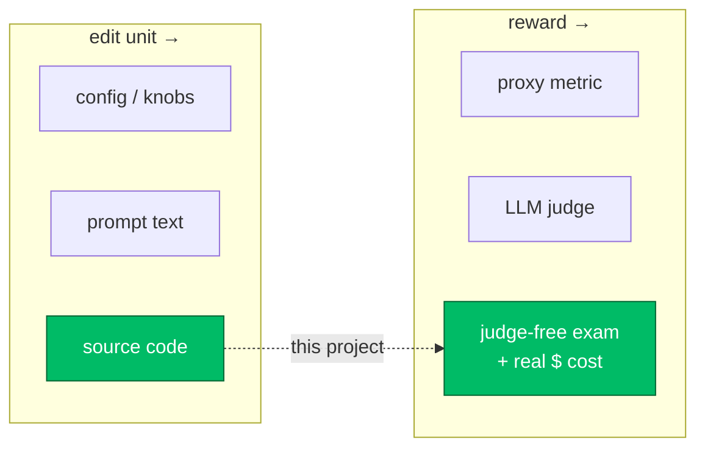
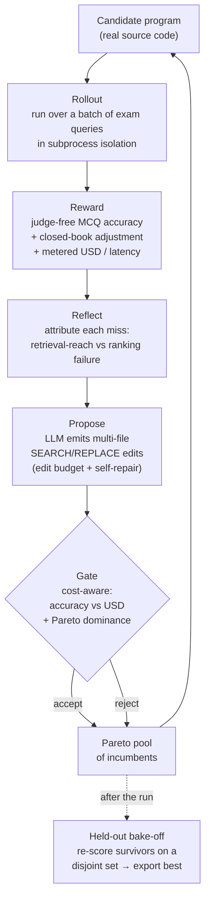
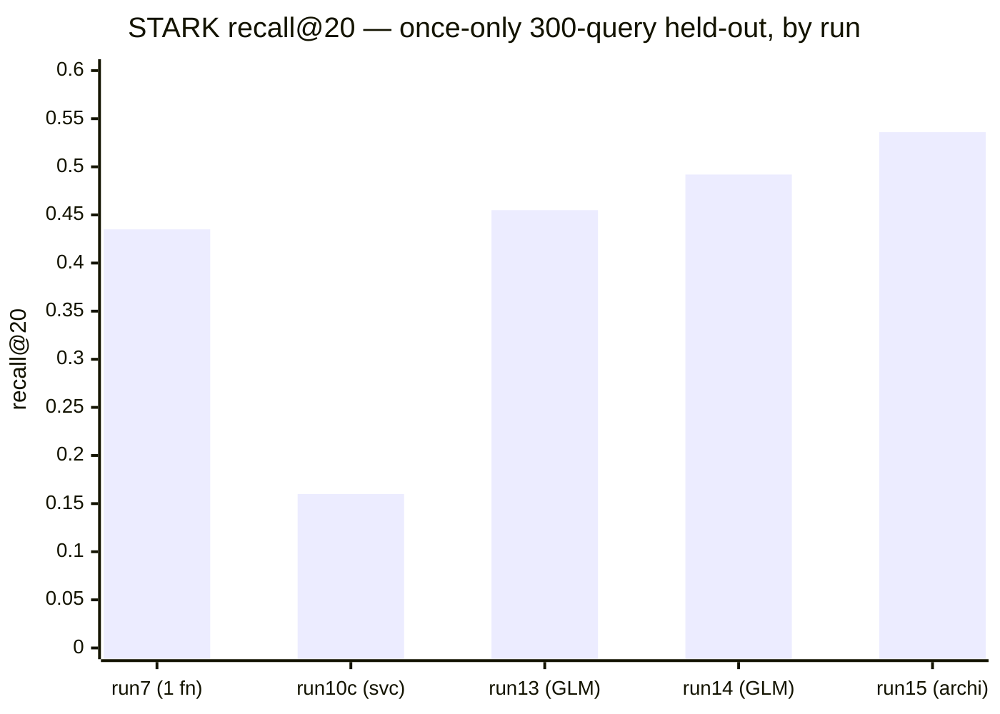
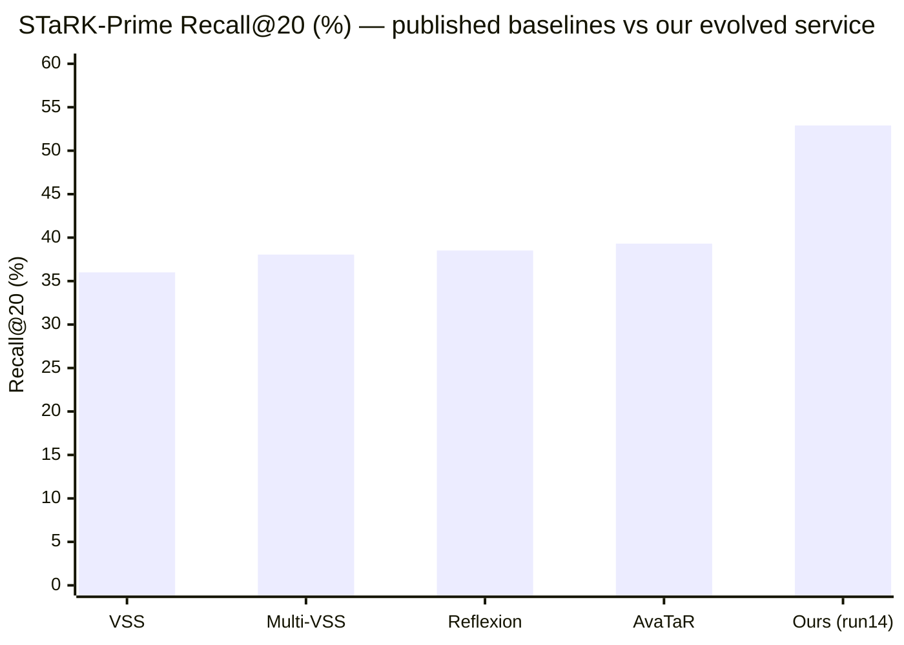

# EvoRetrieve — pushing a self-improving optimizer from one function to a whole RAG system

> **A reflective, LLM-driven code-evolution optimizer applied to retrieval-augmented
> generation (RAG).** It starts by optimizing a single search function on a public
> benchmark, and is being extended toward a multi-component system where *ingestion* and
> *search* are co-optimized. The optimizer rewrites real source code (not a config),
> scores candidates with a judge-free exam, and prices every candidate in **real USD per
> query**.

<!-- Author note: working title "EvoRetrieve". This README is intentionally vision-first
     and light on internal mechanics — the internals are research-grade but not yet
     bulletproof, and they are not the point. The point is the research direction. -->

---

## TL;DR

A new class of system — **self-improving optimizers** that use an LLM as a *mutation
operator* over source code — has produced striking results on math and GPU kernels
([FunSearch](https://www.nature.com/articles/s41586-023-06924-6),
[AlphaEvolve](https://arxiv.org/abs/2506.13131),
[KernelEvolve](https://arxiv.org/abs/2512.23236)). These all share one shape: *propose a
code edit → evaluate it against an oracle → keep it if it wins → repeat.* They have been
pointed almost exclusively at problems with a cheap, exact oracle and a single objective
(speed, or a math score).

**EvoRetrieve asks how far that same optimizer goes when the target is a real agentic RAG
system** — where there is no exact oracle, where quality is semantic, and where every
query costs real money. Two design commitments make the problem tractable:

1. **A judge-free exam as the reward.** Quality is measured by deterministic
   multiple-choice exam accuracy (exact match, no LLM judge to game), with a
   *closed-book adjustment* that isolates what *retrieval* adds over the model's own
   parametric knowledge.
2. **Real USD/query as a first-class objective.** Every candidate is metered in dollars,
   and selection happens on the **accuracy–cost Pareto frontier**, not on accuracy alone.

The project is structured as a **trajectory**, not a single result:

| Phase | Target | What evolves | Status |
|---|---|---|---|
| **1 — single function** | one `search(query, graph)` function over a public KG benchmark (STARK) | one Python function | ✅ working, results below |
| **2 — whole system** | a real graph-retrieval service + its **ingestion** | multi-file source of a live service | 🟢 **search half now beats Phase 1** (results below); ingestion co-opt still ahead — see [Roadmap](#roadmap) |

---

## Why this is interesting (research framing)

RAG quality is dominated by the retrieval stage, and the most consequential retrieval
decisions in a **graph** RAG system are *procedural* — how to seed entities, how far and
how selectively to traverse, when to spend an LLM call to expand or rerank, when to stop.
Those decisions live in **code**, not in a hyperparameter.

Today's automated RAG optimization mostly searches over **configurations** — it
recombines modules an engineer already wrote (e.g.
[AutoRAG](https://arxiv.org/abs/2410.20878); and, *per its public brief*, the ETH Agentic
Systems Lab's reasoning-agent AutoRAG, which proposes pipeline configs from exam
diagnoses). Code-evolution optimizers *can* synthesize genuinely new procedures — but
they've been applied to math and kernels, never to a RAG retrieval node against a live
graph database, and never with money as an objective.

**EvoRetrieve sits at that intersection** and treats it as an open question rather than a
solved one:

The lineage we build on (config search → prompt optimization → code evolution) is
surveyed in [related work](#related-work). The contribution we *claim* is deliberately
narrow and defensible: **applying reflective code evolution to a RAG retrieval system,
gated by a judge-free exam, with measured USD/query as a Pareto axis** — and then asking
how the optimizer behaves as the target grows from one function to a coupled
ingestion+search system.

---

## How the optimizer works

One optimization step is a closed reflective loop. The candidate is **real source code**;
the LLM is the mutation operator; reflection on *why queries failed* is the feedback
signal (a "textual gradient" in the [GEPA](https://arxiv.org/abs/2507.19457) sense).

The pieces, briefly (details in the per-package READMEs):

- **Candidate = code.** A candidate is an *overlay* of edited source files on an
  immutable base, materialized and run in a throwaway subprocess against a live graph
  database — so the optimizer edits the actual service, not a sandboxed toy.
- **Reward = judge-free exam.** Deterministic exact-match MCQ accuracy; a closed-book
  adjustment (`open-book correct − closed-book correct`) credits *retrieval*, not the
  model's memorized knowledge.
- **Feedback = reflection.** Each missed query is bucketed (did retrieval *reach* the
  answer at all, vs did it reach but *rank* it too low?) and fed back as text the next
  edit can act on.
- **Selection = cost-aware Pareto.** Acceptance blends accuracy against measured USD, and
  a Pareto pool keeps a *frontier* of incumbents rather than a single winner. A complexity
  / crash filter stops the optimizer from "winning" with degenerate programs.
- **Honesty = leakage control.** Per-run scores use small rotating gate sets; the number
  worth trusting is the **once-only held-out bake-off** on a disjoint 300-query set.

---

## Results

### Phase 1 — optimizing a single search function on STARK

Public benchmark: [STARK](https://stark.stanford.edu/) (semi-structured retrieval over a
knowledge graph). Metric: node-containment recall / hit / MRR via the STARK evaluator.
The optimizer rewrites one `search(query, graph)` function, starting from a simple
hand-written seed.

| Program | recall@20 | hit@1 | MRR | Evaluated on |
|---|---|---|---|---|
| Hand-written seed | 0.26 | 0.09 | 0.15 | gate set |
| **Optimized (best, exported)** | **0.44** | **0.28** | **0.35** | **300-query held-out** |
| | ×1.7 | ×3.1 | ×2.3 | |

The optimized program is the export from the 300-query held-out bake-off
(`runs/run7/select_holdout.json`); its held-out score matches its in-run score
(`export_changed = false`), i.e. **no overfitting gap** on this run. Absolute numbers on
STARK-prime are modest — the benchmark is hard and old — so the headline is the
**optimization gain from automated code evolution on a public set**, together with the
fact that every candidate was simultaneously **priced in dollars**.

> **Honesty notes (these matter for a research reader).**
> - Per-run gate sets are small (≤30 queries) and therefore noisy; only the 300-query
>   held-out number above should be read as a result.
> - This Phase-1 result was produced by the optimizer's original *single-function*
>   architecture. The Phase-2 *whole-service* extension is **not yet** producing a
>   non-regressing number — see Roadmap.

### Phase 2 — the whole-service target now beats the single function

The Phase-1 win lived in **one** `search()` function. Phase 2 hands the optimizer a
whole **multi-file retrieval service** (`starksearch/` — a real
`StarkGraphSearchService` that owns extraction, vector/text search, graph recall,
fusion and rerank) and lets it rewrite any of it, scored the same judge-free way. This
is strictly harder: more surface to break, and a weak complexity gate lets candidates
bloat and crash.

It did not work on the first try, and the failure is the instructive part. The story
across runs, measured on the **once-only 300-query held-out** bake-off (the same 300
val queries every run — `meta_seed=1234`, so these numbers are directly comparable):

| Run | Target | Mutator | recall@20 | hit@1 | MRR | program size (AST cx) |
|---|---|---|---|---|---|---|
| **run7** | single `search()` fn | Claude Opus | 0.435 | 0.277 | 0.347 | 1006 |
| run10c | whole service (first cut) | Claude Opus | 0.160 | 0.080 | 0.108 | — |
| run13 | whole service | GLM-5.2 (z.ai) | 0.455 | 0.240 | 0.329 | — |
| **run14** | whole service | GLM-5.2 (z.ai) | 0.492 | 0.287 | 0.368 | 2439 |
| **run15** (archipelago) | whole service, seed-chained | GLM-5.2 (z.ai) | **0.536** | 0.270 | 0.368 | 2504 |

- **run10c — the regression.** Opening the multi-file target *lost ~60% of the recall*
  (0.44 → 0.16). The optimizer "won" the small per-step gate with programs that bloated
  and crashed — exactly the code-bloat / crash-rate spiral a single-objective code
  optimizer falls into when the complexity gate is too weak.
- **run11–run13 — the fixes.** A cost-and-complexity *value* gate, a scoring bug fix
  (a cold-cache timeout + a cache-write race that had zeroed run12), and a switch of the
  **mutation LLM to GLM-5.2 (z.ai)** brought it back to Phase-1 level.
- **run14 — surpassing Phase 1.** The stabilized whole-service target reaches **0.492**
  held-out recall@20 — above the single-function 0.435.
- **run15 — archipelago.** Running several islands and *seed-chaining* champions (each
  island reseeded from a previous winner) pushed the best island to **0.536** recall@20 —
  the top result. Most islands regressed; only the fresh chain won, so this is a
  promising-but-noisy orchestration signal, not a robust one yet.

#### Final verdict — 900-query locked test split

The numbers above are the 300-query held-out. For an honest, low-variance headline the
champion **and its seed** were scored once on a **900-query subsample of the locked
`test` split** (2801 queries the optimizer never touched, via
`cli.py final --test-n 900`). The "seed" here is not naive — it is the Phase-1 levers
(typed anchor-hop + per-keyword conjunction bridge) ported into the service — so this
isolates what *whole-service evolution adds on top of Phase-1 knowledge*:

| Metric | Seed (Phase-1 levers) | **Evolved service (run14)** | Δ |
|---|---|---|---|
| recall@20 | 0.476 | **0.529** | **+0.054** |
| hit@1 | 0.240 | **0.282** | **+0.042** |
| hit@5 | 0.418 | **0.498** | **+0.080** |
| MRR | 0.327 | **0.382** | **+0.055** |

run14 is the **verified** 900-query champion. (run15's archipelago champion tops the
300-query held-out at 0.536, but its 900-query test pass is not yet verified — the run
hit an external OpenRouter credit ceiling part-way through — so run14 is reported as the
headline until run15 is re-scored at scale.)

#### How it stacks up on the STaRK-Prime leaderboard

We use STaRK's own `Evaluator` on the `prime` **test split**, so our numbers line up
directly against the published
[STaRK leaderboard](https://huggingface.co/spaces/snap-stanford/stark-leaderboard)
(all values are percentages):

| Method (STaRK-Prime test) | Hit@1 | Hit@5 | Recall@20 | MRR |
|---|---|---|---|---|
| VSS (text-embedding-ada-002) | 12.63 | 31.49 | 36.00 | 21.41 |
| Multi-VSS | 15.10 | 33.56 | 38.05 | 23.49 |
| Reflexion (LLM agent) | 14.28 | 34.99 | 38.52 | 24.82 |
| AvaTaR (LLM-**agent** optimizer) | 18.44 | 36.73 | 39.31 | 26.73 |
| **Ours — evolved service (run14)** | **28.2** | **49.8** | **52.9** | **38.2** |

Baselines are from the [STaRK paper](https://arxiv.org/abs/2404.13207) and
[AvaTaR](https://arxiv.org/abs/2406.11200), on the same test split. The evolved service
beats them on **every** metric — most strikingly **Recall@20 (+13.6 pts over AvaTaR)** —
because it doesn't just *rerank* a dense pool (reranking leaves Recall@20 roughly flat),
it *expands reach*: typed anchor-hop traversal, per-keyword conjunction bridges, and query
reformulation. The apples-to-apples point is that it beats **AvaTaR, itself an LLM
optimizer for this exact benchmark** — reflective *code* evolution vs agent-*prompt*
optimization. (Specialized 2025 methods — LLM query-expansion, fine-tuned GraphRAFT —
report higher and are out of scope for this baseline comparison.)

**How — and what it cost.** The optimizer's *mutation* model (the LLM that rewrites the
service's source) was **GLM-5.2** (via z.ai) — **~$5–6** for the whole run. Retrieval-time
inference — entity extraction, LLM rerank, query reformulation — ran on **Gemini 2.5 Flash
Lite** through OpenRouter, with **`text-embedding-3-small`** for vectors. End to end,
evolving a leaderboard-beating STaRK-Prime service cost **~$10–15**: cheap mutation plus a
tiny retrieval model, **no GPT-4 anywhere in the loop** — yet it clears the GPT-4-reranker
and AvaTaR numbers.

> **Honesty notes.**
> - Per-run gate sets are small (≤30 queries in the whole-service runs) and noisy; only
>   the 300-query held-out and the 900-query test numbers should be read as results.
> - The whole-service target is better but **more fragile** than the single function —
>   several pool candidates still crash on the full held-out set, and program size roughly
>   doubled (1006 → ~2500 AST-complexity). Tightening the complexity/crash gate is ongoing.
> - This is the **search** half of Phase 2. The harder, more interesting half —
>   co-optimizing the **ingestion** that builds the graph — is still ahead (Roadmap).

---

## Roadmap

- [x] **Phase 2: stabilize the whole-service target** — fixed the bloat/crash spiral
      (cost-and-complexity value gate + scoring-race fix + GLM-5.2 mutator) so multi-file
      evolution now **beats** the single-function result (run14 0.492 / run15 0.536 held-out
      recall@20 vs run7 0.435). *Crash-hardening the pool is still ongoing.*
- [ ] **Co-optimize ingestion + search** — let the optimizer change how the graph is built,
      and measure the coupling between ingestion choices and downstream retrieval.
      ([`graphmod/`](graphmod) is the typed Neo4j ingestion framework this will plug into —
      today it is a clean schema/ingestion layer, *not yet* under optimizer control.)
- [ ] **Controlled science** — a like-for-like configuration-search baseline over the same
      knobs, a second corpus + held-out exam split, the cost-weight frontier sweep, and the
      reflection-on/off ablation. *(This is the empirical study, not yet run.)*

---

## Repository layout

| Path | What it is |
|---|---|
| [`graphretr-demo/`](graphretr-demo) | The optimizer core + Phase-1 STARK environment, runs, MLflow. See its README. |
| [`starksearch/`](starksearch) | Phase-2 whole-service STARK target (subprocess, multi-file). |
| [`graphsearch/`](graphsearch) | A second end-to-end agentic-retrieval target (graph QA). |
| [`graphmod/`](graphmod) | Typed, validated **Neo4j ingestion / schema framework** (TypeScript). Standalone today; the future ingestion-optimization target. |
| [`Orchestration/`](Orchestration) | Design docs / run plans. |

**Stack.** Python 3.11 (optimizer + targets), TypeScript/Node (`graphmod`). LLM backends
via OpenRouter (retrieval-time models + embeddings) and a configurable mutation backend.
Experiment tracking via MLflow.

> ⚠️ **Repo hygiene is mid-cleanup** — a tracked `.venv/`, caches, and a run graveyard are
> being removed (see the working cleanup plan). If you are reviewing this, the files worth
> reading are `graphretr-demo/src/graphretr_opt/optimizer/` (the loop, pool, and gate) and
> the per-package READMEs.

---

## Related work

The systems EvoRetrieve builds on and positions against:

- **Code evolution** — [FunSearch](https://www.nature.com/articles/s41586-023-06924-6)
  (Nature 2024), [AlphaEvolve](https://arxiv.org/abs/2506.13131) (DeepMind 2025),
  OpenEvolve, and [KernelEvolve](https://arxiv.org/abs/2512.23236) (Meta, kernel
  optimization). *Evolve source code; target math / kernels / speedup, not RAG, not $.*
- **Reflective prompt / pipeline optimization** —
  [GEPA](https://arxiv.org/abs/2507.19457) (reflective Pareto prompt evolution),
  [DSPy / MIPROv2](https://arxiv.org/abs/2406.11695), OPRO, TextGrad, Reflexion. *Optimize
  prompts / compound-AI parameters, not procedural retrieval code.*
- **Agent / skill design** — [Voyager](https://arxiv.org/abs/2305.16291) (lifelong skill
  library as code) and [ADAS](https://arxiv.org/abs/2408.08435) (automated design of
  agentic systems). *Closest in spirit to evolving a whole system.*
- **AutoML for RAG** — [AutoRAG](https://arxiv.org/abs/2410.20878) (greedy module/grid
  search) and the exam-generation evaluation of
  [Guinet et al.](https://arxiv.org/abs/2405.13622) (ICML 2024) that judge-free RAG scoring
  builds on. *Search over configurations of pre-built modules.*

A fuller, vendor-neutral survey of this landscape lives in the companion optimizer wiki.
