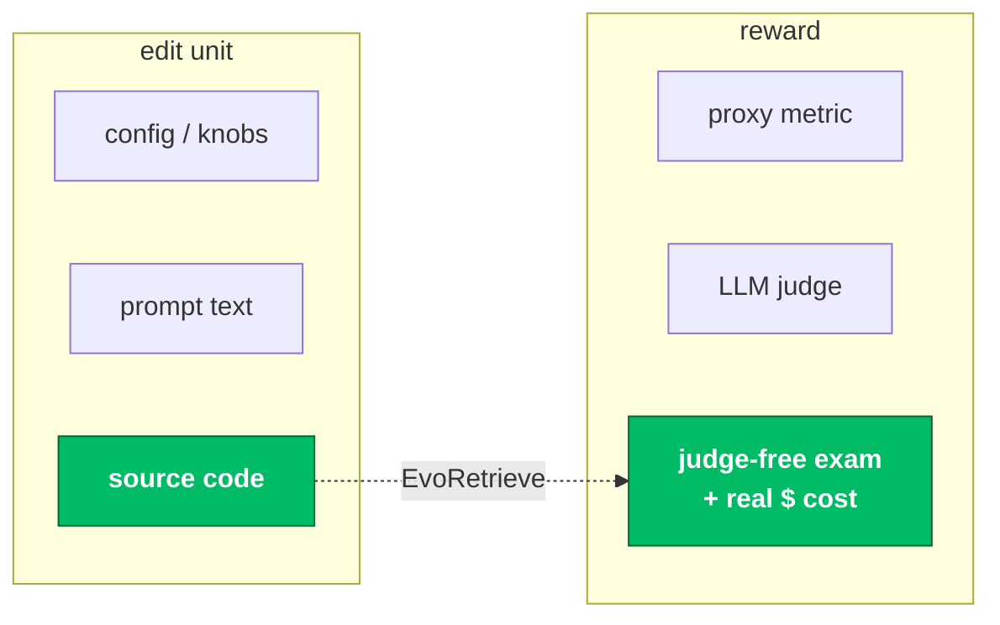
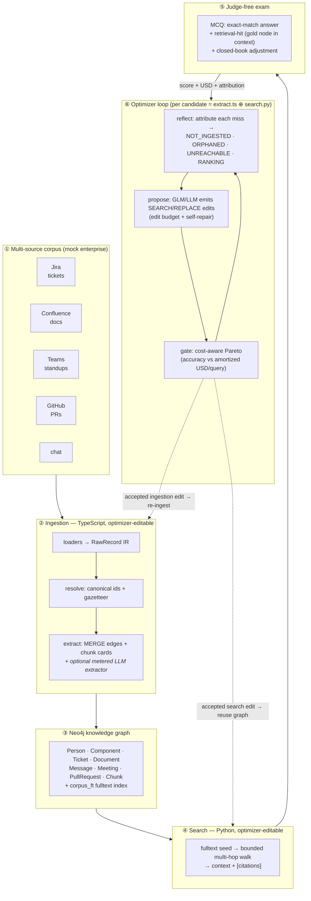
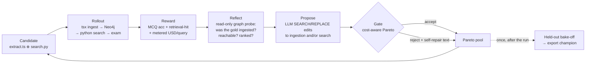
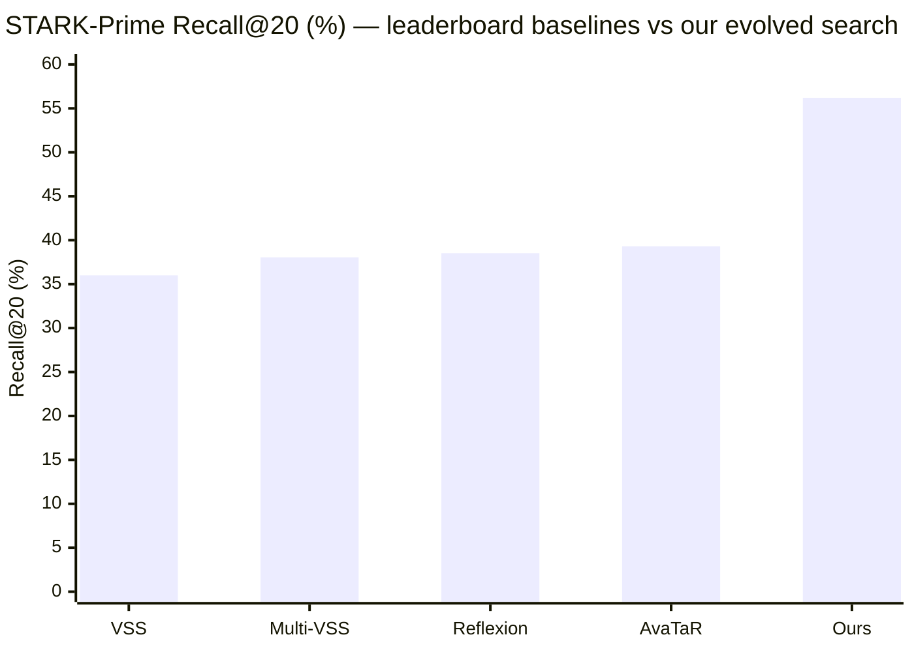

# EvoRetrieve

### A self-improving optimizer that rewrites the source code of a GraphRAG system — co-evolving **ingestion** and **search**, gated by a judge-free exam and priced in **real USD per query**.

**code-evolution** · **judge-free reward** · **accuracy–cost Pareto** · **ingestion ⊕ search co-design**

---

## Abstract

Self-improving "code-evolution" optimizers — FunSearch, AlphaEvolve, kernel-evolution
systems — turn an LLM into a *mutation operator* over source code: **propose an edit →
evaluate against an oracle → keep it if it wins → repeat.** They have produced striking
results, but almost exclusively where the oracle is cheap and exact and the objective is a
single number (a math score, a kernel speedup).

**EvoRetrieve asks how far that idea goes when the target is a real, multi-component GraphRAG
system** — where quality is semantic, the graph must be *built* before it can be searched,
and every query costs money. The optimizer edits the **actual TypeScript ingestion** that
builds a Neo4j knowledge graph **and** the **Python search** that traverses it, scores each
candidate with a **deterministic multiple-choice exam** (no LLM judge to game), meters every
candidate in **real USD/query**, and selects on the **accuracy–cost Pareto frontier**.

> **Headline.** On a hand-built 5-source enterprise corpus (Jira · Confluence · Teams ·
> GitHub · chat → 219-node graph, 81-question exam), the optimizer lifted a hand-written
> seed from **0.767 → 0.967 MCQ accuracy** (retrieval-hit 0.73 → 1.00), holdout-confirmed at
> **0.964** — automatically, by co-evolving the search procedure. On the public **STARK**-Prime
> benchmark (Phase 1) it lifted a seed search function from **recall@20 0.26 → 0.44 / hit@1
> 0.09 → 0.28** (300-query held-out, no overfitting gap); scaled to a full multi-file service,
> its best evolved search **beats every published STARK-Prime baseline** — Recall@20 **0.56**
> vs AvaTaR 0.39 on a 900-query held-out test split.

---

## 1 · The gap

RAG quality is dominated by retrieval, and the most consequential retrieval decisions in a
**graph** RAG system are *procedural* — how to seed entities, how far and how selectively to
traverse, when to spend an LLM call, when to stop — **and how the graph was built in the
first place.** Those decisions live in **code**, not in a hyperparameter.

Today's automated RAG optimization mostly searches over **configurations**: it recombines
modules an engineer already wrote ([AutoRAG](https://arxiv.org/abs/2410.20878)). Code-evolution
optimizers *can* synthesize genuinely new procedures — but they've been pointed at math and
kernels, never at a RAG node against a live graph, never with money on the objective, and
**never at the coupling between *ingestion* and *search*** — the case where changing how the
graph is built reshapes what search must do, so the two have to be optimized *together*.

**The claim is deliberately narrow and defensible:** reflective code-evolution applied to a
GraphRAG system, gated by a judge-free exam, with measured USD/query as a Pareto axis — and a
characterization of how the optimizer behaves as the target grows from **one function** to a
**coupled ingestion + search system.**

---

## 2 · System architecture

A *candidate* is an overlay of two real source files — the **ingestion** (`extract.ts`, builds
the graph) and the **search** (`search.py`, traverses it). Scoring is a **two-phase rollout**:
rebuild the graph, then search it over the exam. Ingestion is cached by the hash of the `.ts`
files, so a search-only edit reuses the graph and only an ingestion edit triggers a rebuild.

**Where each part runs.** Ingestion is a one-shot `tsx ingest.ts` subprocess that `--wipe`s and
rebuilds an **isolated Neo4j database** from the candidate's `extract.ts`. Search is the
candidate's `search.py`, imported fresh per candidate (throwaway module) and run in-process
against that graph — the same answerer/USD path as production scoring. The winner is exported
and can be lifted straight back into the live retrieval service.

---

## 3 · How one optimization step works

- **Candidate = code.** Real source, run against a live graph DB in subprocess isolation — not a sandboxed toy.
- **Reward = judge-free exam.** Deterministic exact-match MCQ accuracy; a closed-book adjustment credits what *retrieval* adds over the model's parametric knowledge.
- **Feedback = graph-aware attribution.** Every miss is probed read-only and bucketed
  `NOT_INGESTED` (gold node absent) / `ORPHANED` (present, no path from seeds) / `UNREACHABLE`
  (path exists, search didn't reach it) / `RANKING` — so the optimizer is told *which side to fix.*
- **Selection = cost-aware Pareto.** Acceptance blends accuracy against amortized USD/query
  (`ingest_usd / N + search_usd`); a Pareto pool keeps a frontier, not one winner; a
  complexity/crash filter stops degenerate "wins."
- **Honesty = leakage control.** Per-run scores use small rotating gate sets; the trustworthy
  number is the once-only held-out bake-off.

---

## 4 · Results

### Phase 2 — co-optimizing ingestion + search on a multi-source graph

A hand-built mock enterprise corpus spanning **five sources** — Jira, Confluence, Teams
standups, GitHub PRs, and chat — ingested into a **219-node / 485-edge** Neo4j graph with
genuine cross-system chains (*a problem in a Jira ticket → its solution decided in a Teams
standup → implemented in a GitHub PR → documented in Confluence*). The exam is **81 judge-free
MCQs** (30 structured · 12 multi-hop · 7 cross-source · 20 free-text · 12 multi-gold/aggregation).

| Program | MCQ accuracy | retrieval-hit | ingest USD | total USD/query |
|---|---|---|---|---|
| Hand-written seed (zero-LLM ingestion) | 0.767 | 0.733 | $0.000 | ~$0.0002 |
| **Co-optimized (best, exported)** | **0.967** | **1.000** | **$0.000** | ~$0.0002 |
| | **+0.20** | **+0.27** | — | held-out **0.964** |

The optimizer reached 0.967 by **co-evolving the search procedure** (widening the fulltext
seed, adding exact-id seeding, deepening the bounded walk) — selected over paying for LLM
extraction because the cost-aware gate preferred the **$0** fix (see §5).

```mermaid
xychart-beta
    title "Phase 2 — co-optimize ingestion+search: seed → optimized"
    x-axis ["MCQ accuracy", "retrieval-hit"]
    y-axis "score" 0 --> 1
    bar [0.767, 0.733]
    bar [0.967, 1.000]
```

left bar = hand-written seed · right bar = co-optimized & held-out-confirmed (0.964). STARK
is a *different* benchmark with a *different* metric — it gets its own chart and its own
leaderboard comparison below, never mixed into this one.

### Phase 1 — STARK-Prime, versus the public leaderboard

Public benchmark: [STARK](https://stark.stanford.edu/)-Prime (Stanford, NeurIPS 2024) —
semi-structured retrieval over a 129k-node biomedical KG (2,801-query test split), scored by
node-containment Hit@1 / Hit@5 / Recall@20 / MRR. The optimizer first rewrites one
`search(query, graph)` function, then graduates to the whole multi-file retrieval service.

**Single function (origin).** Hand-written seed → exported champion on a disjoint 300-query
held-out set, no measurable overfitting gap:

| Program | recall@20 | hit@1 | MRR | Evaluated on |
|---|---|---|---|---|
| Hand-written seed | 0.26 | 0.09 | 0.15 | gate set |
| **Optimized (exported)** | **0.44** | **0.28** | **0.35** | **300-query held-out** |
| | ×1.7 | ×3.1 | ×2.3 | no overfitting gap |

**Best evolved search (whole multi-file service), 900-query locked `test` split.** Scaling
the target from one function to a full service and switching the mutator to GLM-5.2 lifts it
past the single function **and past every published STARK-Prime baseline.** Two champions
split the metrics — both clear the leaderboard on every one (percentages):

| STARK-Prime test | Hit@1 | Hit@5 | Recall@20 | MRR |
|---|---|---|---|---|
| VSS (text-embedding-ada-002) | 12.63 | 31.49 | 36.00 | 21.41 |
| Multi-VSS | 15.10 | 33.56 | 38.05 | 23.49 |
| Reflexion (LLM agent) | 14.28 | 34.99 | 38.52 | 24.82 |
| AvaTaR (LLM-**agent** optimizer) | 18.44 | 36.73 | 39.31 | 26.73 |
| **Ours — run14 (balanced)** | **28.2** | **49.8** | 52.9 | **38.2** |
| **Ours — run15 (recall-max)** | 27.2 | 49.1 | **56.2** | 37.4 |

Baselines: [STARK paper](https://arxiv.org/abs/2404.13207) · [AvaTaR](https://arxiv.org/abs/2406.11200),
same test split · [leaderboard](https://huggingface.co/spaces/snap-stanford/stark-leaderboard).

It beats **AvaTaR — itself an LLM optimizer for this exact benchmark** — by **+16.9 pts
Recall@20** and **+9.8 pts Hit@1**: reflective *code* evolution over agent-*prompt*
optimization. The lift comes from *expanding reach* (typed anchor-hop, per-keyword
conjunction bridges, query reformulation), not just reranking a dense pool — and it cost the
GLM-5.2 mutator (~$5–6) plus Gemini-2.5-Flash-Lite retrieval, **no GPT-4 in the loop.**
(Specialized 2025 methods — LLM query-expansion, fine-tuned GraphRAFT — report higher and are
out of scope for this baseline comparison.)

---

## 5 · Analysis — *why* it behaves this way

- **Attribution localizes the fix.** On the multi-source corpus the seed's misses probed as
  `UNREACHABLE` (the answer nodes — PRs, docs — sat just beyond the selective retriever). The
  optimizer followed that signal and edited **search**, not ingestion — the right lever.
- **Coupling is real and observable.** On a smaller corpus where *search was frozen*, the same
  misses forced an **ingestion** fix instead: the optimizer added graph-transitivity edges so
  the answer became reachable within the bounded walk (0.93 → 0.97). Flip which file is editable
  and the optimizer co-adapts the other side — the central claim, shown both ways.
- **The cost-aware gate refuses to overspend.** We deliberately planted questions whose answer
  link lives *only* in prose (no rule-based edge — Cypher-proven). The optimizer **still never
  turned on the LLM extractor**: widening fulltext search retrieved the answer chunk directly,
  for **$0**, so paying tokens for extraction was correctly rejected. *A negative result that is
  itself a finding:* with fulltext seeding + an LLM answerer, making expensive ingestion the
  **only** way to win is a genuine reward-design problem — exactly the kind of honesty the gate
  is there to enforce.

---

## 6 · Limitations & reproducibility

- **Corpus design is the binding constraint.** Whether the optimizer has *attributable headroom*
  — and whether an expensive lever is ever *necessary* — is decided by the exam, not the engine.
  Making LLM extraction strictly required (vs. substitutable by search) is open work.
- **Mutator reliability.** The GLM (z.ai) mutation backend intermittently emits unparseable
  edits (~30–40% of steps), which burns budget; this is a fixable parsing/format issue, not a
  loop defect.
- **Reproducibility.** Two-phase rollout against a live Neo4j DB; MLflow tracking; per-run
  rotating gate sets + a once-only held-out bake-off; complexity/crash filters. Runs land under
  `graphretr-demo/runs/<name>/` with full lineage (`lineage.jsonl`), per-step overlays, the
  reflection transcripts, and the exported champion.

---

## 7 · Repository layout

| Path | What it is |
|---|---|
| [`graphretr-demo/`](graphretr-demo) | The optimizer core — loop, Pareto pool, cost-aware gate, two-phase reward adapter, attribution probe, MLflow. |
| [`graphmod/`](graphmod) | Typed, validated **Neo4j ingestion framework** (TypeScript). The optimizer-editable `extract.ts` + schema modules for all 7 node types. |
| [`graphsearch/`](graphsearch) | The graph-QA target: editable `search.py`, the mock 5-source corpus, and the judge-free MCQ exam. |
| [`starksearch/`](starksearch) | Phase-1/2 STARK target (public benchmark). |
| [`Orchestration/`](Orchestration) | Design docs / co-optimize contract + runbooks. |

**Stack.** Python 3.11 (optimizer + search), TypeScript/Node (`graphmod` ingestion), Neo4j 5
(Enterprise, multi-db isolation). Answerer + in-search LLM via OpenRouter; the code-mutation
backend is GLM via z.ai (or the Claude CLI). Experiment tracking via MLflow.

---

## 8 · Related work

- **Code evolution** — [FunSearch](https://www.nature.com/articles/s41586-023-06924-6),
  [AlphaEvolve](https://arxiv.org/abs/2506.13131), OpenEvolve,
  [KernelEvolve](https://arxiv.org/abs/2512.23236). *Evolve code; target math / kernels, not RAG, not $.*
- **Reflective prompt / pipeline optimization** — [GEPA](https://arxiv.org/abs/2507.19457),
  [DSPy / MIPROv2](https://arxiv.org/abs/2406.11695), OPRO, TextGrad, Reflexion. *Optimize prompts, not procedural code.*
- **Agent / skill design** — [Voyager](https://arxiv.org/abs/2305.16291),
  [ADAS](https://arxiv.org/abs/2408.08435). *Closest in spirit to evolving a whole system.*
- **AutoML for RAG** — [AutoRAG](https://arxiv.org/abs/2410.20878) and the exam-generation
  evaluation of [Guinet et al.](https://arxiv.org/abs/2405.13622) that judge-free RAG scoring builds on. *Search over configurations of pre-built modules.*

The open research framing — matching the *search topology* to the design space's factor
structure (structured niching, branch-and-converge, staged credit assignment) — is mapped in
`Orchestration/` and the companion optimizer wiki.
